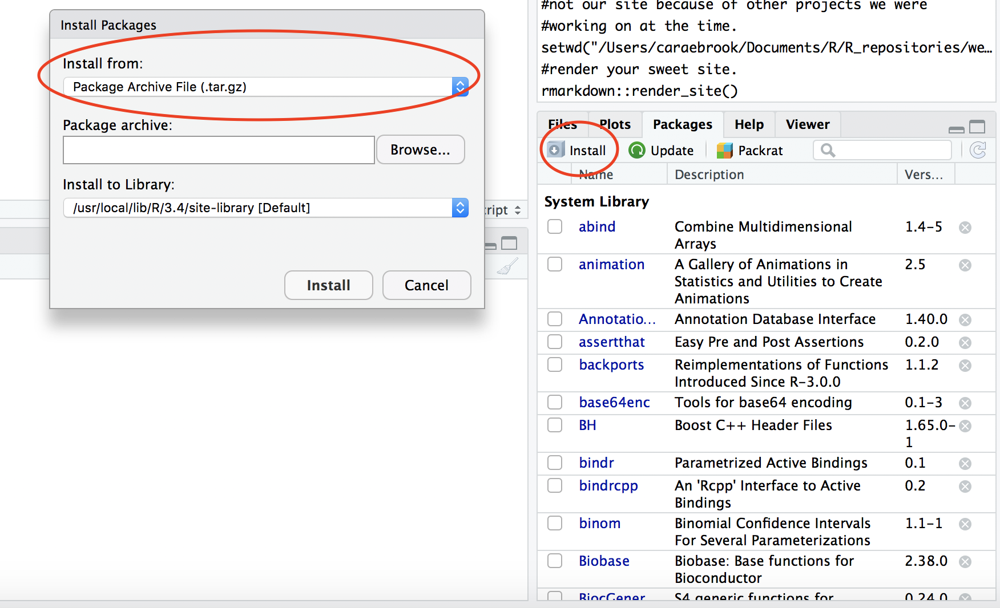

## Installing Packages for E^2^M^2^

### With internet access

For most of you, you should be able to install all required packages for E^2^M^2^ by copying and pasting the following SINGLE command into your R console:


```{r echo=TRUE, message=TRUE, warning=TRUE, eval=FALSE}

install.packages(c("arm", "asnipe", "coloRamps", "deSolve", "dplyr", "ergm", "ggplot2", "googleway", "igraph", "installr", "lattice", "leaflet", "lme4", "maps", "maptools", "MASS", "Matrix", "minqa", "mgcv",  "mgcv", "network", "nlme", "plyr", "raster", "Rcpp", "reshape", "reshape2", "rgdal", "rgeos", "sp", "survival", "tnet", "unmarked"))

```

### Without internet access 

If, however, you do not have access to the internet on the computer which you would like to install these packages, you will need to first download the source files for these packages on a different computer and transfer them to a USB flash drive to bring onto your home computer (see links under #2, below). The files are also available on Cara's USB drive if you would just like to copy them directly. Then, follow the directions below to complete this installation in RStudio:

1. Save the individual R source files in the working library for your version of RStudio. You will need to take the files out of the folder they are downloaded/transported in and drop each individually into your R library.You can access this by typing .libPaths() and R should path to your library. It may be that you have two libraries: (1) a base library that is not writeable and a local library that is writeable. If this is the, then save the files to your local library.
2. To start, we recommend only [downloading the tar.gz](E2M2_tar_gz.zip) files into your library. If you have problems you can then try [downloading the .zip](E2M2_win_zip.zip) versions of each package, but hopefully, the tar.gz will work on the first try.
3. Once the source files for all of the packages have been saved, you can install the files using the **Installer** tool in R Studio. You will need to select "Install from: Package Archive File" (not CRAN), then navigate to the library where you just saved each file under the Packages header, then select that same folder under "Install to Library".
4. Then, click Install, and the file should get loaded into your R console. 
5. Unfortunately, each file will need to be loaded and installed individually.
6. Once all packages have been installed, make sure they can be loaded by typing library("packagename") in your R console, and check that there are no warnings.
7. When you are confident that all packages are installed you can delete any original tar.gz files left in your R library folder.



If you run into issues, please don't hesitate to ask a mentor or teacher for help!
