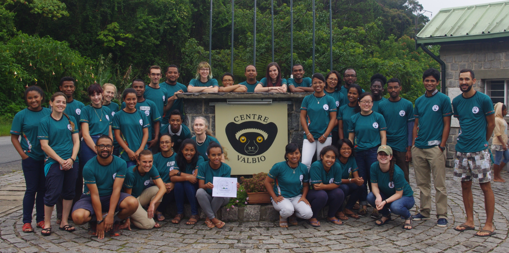

---
output:
  html_document: default
  pdf_document: default
---
 

**E^2^M^2^:  Ecological & Epidemiological Modeling in Madagascar**

**January 3-14, 2020** 

**Institut Pasteur de Madagascar, Antananarivo & Centre ValBio, Ranomafana National Park** 

---
We are pleased to announce the fourth annual E^2^M^2^:  Ecological and Epidemiological Modeling in Madagascar, to be held January 3-14, 2020, with time split between Institut Pasteur de Madagascar (IPM) in Antananarivo and Centre ValBio (CVB) in Ranomafana National Park, Madagascar. The course will include a 3-day introduction to basic programming in R ('R Bootcamp') to be held at IPM, followed by a week-long intensive workshop at CVB aimed to provide an introduction to the use of dynamical models in understanding ecological and epidemiological data. Finally, students will present research plans in a final symposium to follow the workshop, once again at IPM.

Throughout E^2^M^2^, students will participate in a series of interactive lectures and computer-based tutorials and learn to fine-tune model-based research questions, develop clear model frameworks and corresponding equations, and fit models to real-world data. All students will work closely with peers and faculty to develop a research plan for an ongoing or existing project integrating dynamical modeling with data collection and/or analysis in a biological system of their choosing. These research plans can then be used as a foundation for future dissertation or grant proposals. 

The course will be targeted towards students in their third cycle or higher in biology, mathematics, medicine, public health, or related fields, though all are welcome to apply. The course will be taught primarily in English, though a subset of the faculty will be available to offer some translation into French and/or Malagasy. A working knowledge of the English language is required for admission; however, we will do our best to make the material accessible to students who find English challenging.

A working outline of our 2020 syllabus is available for your perusal [here](E2M2_2020.html), and materials from previous years' courses can be accessed at [E^2^M^2^ 2018](E2M2_2018.html) and [E^2^M^2^ 2019](E2M2_2019.html).

---

**We are seeking new instructors for E^2^M^2^ 2020!**

**[Application](https://airtable.com/shrAk41LfK72Xaabn) Due Date: May 31, 2019**

**We ask that anyone interested in teaching E^2^M^2^ 2020, please fill out the application linked above by midnight on Friday, May 31, 2019 in your country of residence.** Applications will be reviewed by our organizing committee, and next year's teaching team will be assembled sometime in June. 

Instructors will need to be fully conversant in English, with additional language skills in Malagasy and/or French considered a bonus. Additionally, instructors will need to feel comfortable teaching a majority of the materials covered in previous E^2^M^2^ modules (syllabi and materials linked above). Ideas and skillsets that would expand our curriculum in complimentary ways are valued and encouraged. If you have any questions about the appropriateness of your background or training for instructing our course, either in language or in science, please do not hesitate to contact us at the emails listed below. 

In the past, instructors have funded their own travel to Madagascar (if not already based in country), as well as food and lodging for the sections of the course held in Antananarivo. Funding is available within the organizing committee to cover in-country transportation from Antananarivo to Ranomafana and back, in addition to room and board throughout the duration of the core clinic (January 6-12), for all instructors. We will consider requests for additional financial support on a case-by-case basis, based on information collected in the application.

Please do not hesitate contact Cara Brook [(cbrook@berkeley.edu)](cbrook@berkeley.edu), Tanjona Ramiadantsoa [(ramiadantsoa@wisc.edu)](ramiadantsoa@wisc.edu), or Fidisoa Rasambainarivo [(fidy@mahaliana.org)](fidy@mahaliana.org) with any questions or concerns. We look forward to reviewing your application!

---

**Applications for students will become available in September 2019. Please check back at that time.**

---

Misaotra betsaka from the E^2^M^2^ organizing team!

[Cara Brook](https://carabrook.github.io), [Tanjona Ramiadantsoa](https://ramiadantsoa.github.io), and [Fidisoa Rasambainarivo](https://fidyras.com/)
 

