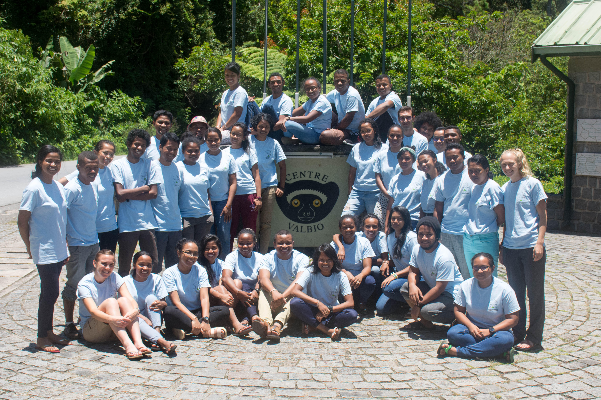

**Due to COVID-19, E^2^M^2^ 2021 is on hold until further notice. Please check back here for updates in the coming months.**

---

**January 3-14, 2020** 

**Institut Pasteur de Madagascar, Antananarivo & Centre ValBio, Ranomafana National Park** 

---
We are pleased to announce the fourth annual E^2^M^2^:  Ecological and Epidemiological Modeling in Madagascar, to be held January 3-14, 2020, with time split between Institut Pasteur de Madagascar (IPM) in Antananarivo and Centre ValBio (CVB) in Ranomafana National Park, Madagascar. The course will include a 2-day introduction to basic programming in R ('R Bootcamp') to be held at IPM, followed by a week-long intensive workshop at CVB aimed to provide an introduction to the use of dynamical models in understanding ecological and epidemiological data. Finally, students will present research plans in a final symposium to follow the workshop, once again at IPM.

Throughout E^2^M^2^, students will participate in a series of interactive lectures and computer-based tutorials and learn to fine-tune model-based research questions, develop clear model frameworks and corresponding equations, and fit models to real-world data. All students will work closely with peers and faculty to develop a research plan for an ongoing or existing project integrating dynamical modeling with data collection and/or analysis in a biological system of their choosing. These research plans can then be used as a foundation for future dissertation or grant proposals. 

The course will be targeted towards students in their third cycle or higher in biology, mathematics, medicine, public health, or related fields, though all are welcome to apply. The course will be taught primarily in English, though a subset of the faculty will be available to offer some translation into French and/or Malagasy. A working knowledge of the English language is required for admission; however, we will do our best to make the material accessible to students who find English challenging.

---

A working outline of our 2020 syllabus is available for your perusal [here](E2M2_2020.html), and materials from previous years' courses can be accessed at [E^2^M^2^ 2018](E2M2_2018.html) and [E^2^M^2^ 2019](E2M2_2019.html).

Please do not hesitate contact Cara Brook [(cbrook@berkeley.edu)](cbrook@berkeley.edu), Tanjona Ramiadantsoa [(ramiadantsoa@wisc.edu)](ramiadantsoa@wisc.edu), or Fidisoa Rasambainarivo [(fidy@mahaliana.org)](fidy@mahaliana.org) with any questions or concerns.

---

Misaotra betsaka from the E^2^M^2^ organizing team!

[Cara Brook](https://carabrook.github.io), [Tanjona Ramiadantsoa](https://ramiadantsoa.github.io), and [Fidisoa Rasambainarivo](https://fidyras.com/)
 

