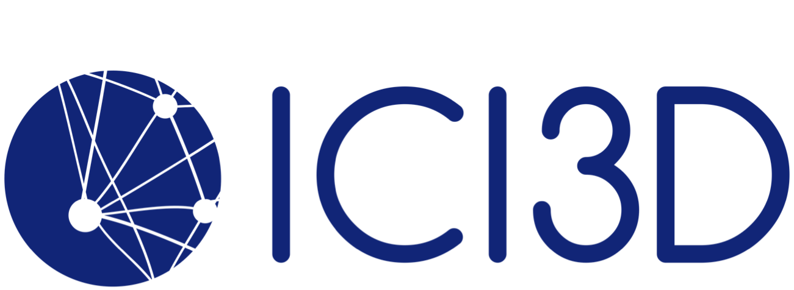

 

**Collaborating Institutions**

 

Many of the materials and methods used in E^2^M^2^ were adapted  

from those previously developed by faculty at [ICI3D](ici3d.org):
 

 

**Sponsors**

 

Thanks to our sponsors:
 

